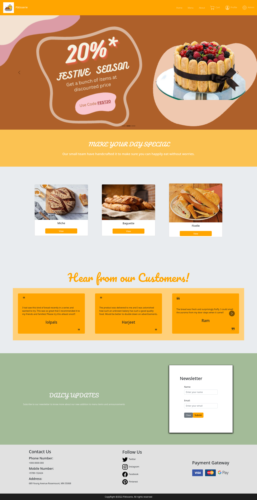
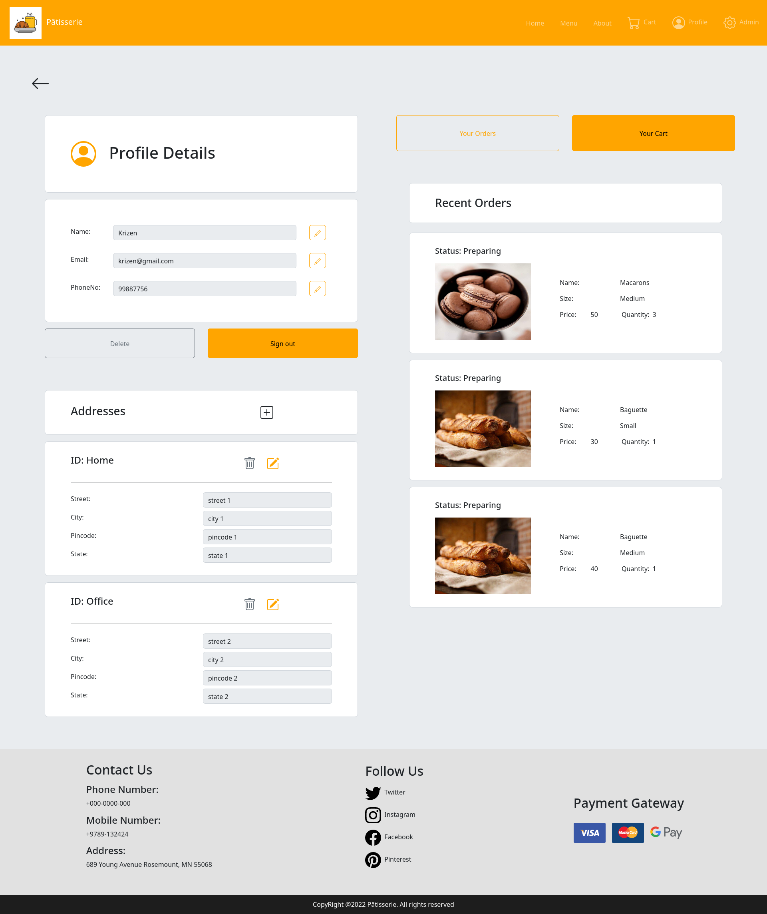
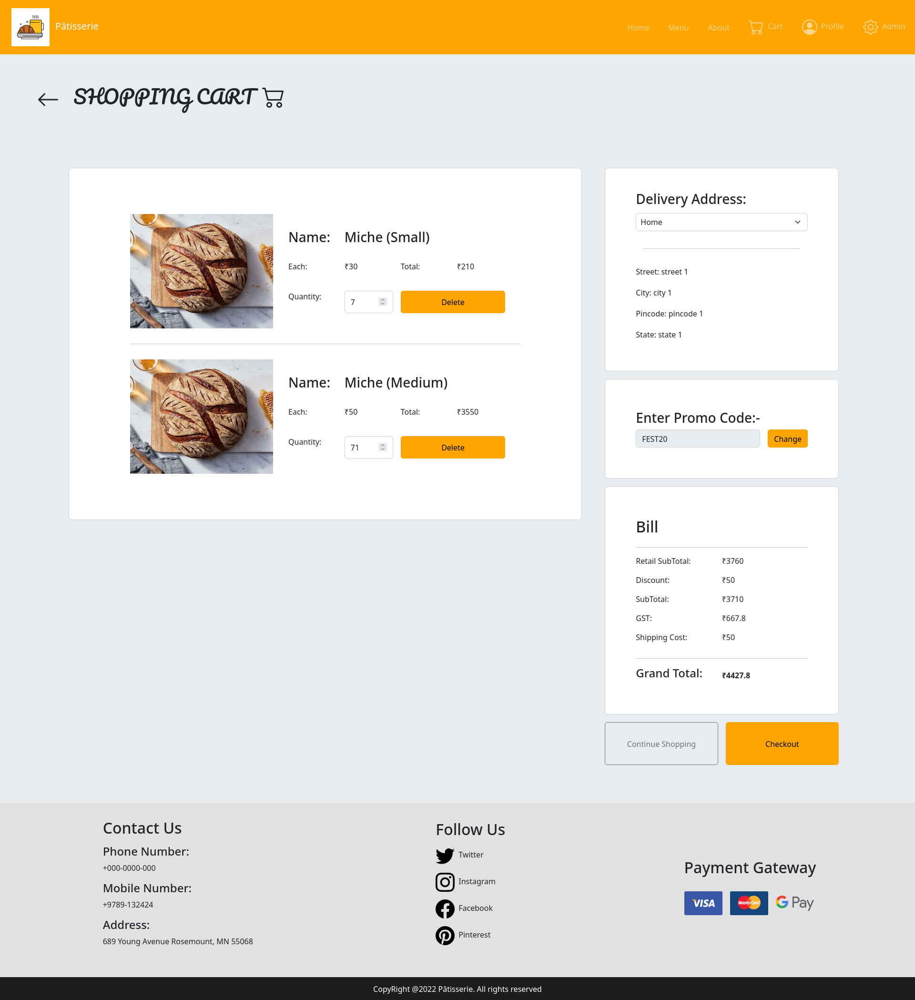

# Pâtisserie

- This project is made for the distribution of Bakery Products.
- Technologies used are MERN Stack, JWT Auth, Rest API, etc

> **Warning:**
> The Images and Banners needs to be created and feeded before running the program

#### Minimum Requirements:

1. CPU: 4core
2. RAM: 4GB
3. Storage: HDD

> Project can run on both Windows and Linux Servers

---

# Instructions

1. Clone or download the project.
2. In indiviual folders(frontend,backend) install the node modules using

```
npm install .
```

3. Then go to the MongoDB Atlas, create an account then a cluster and get the API token
4. Create a `.env` file in backend folder with an entry:

```
MONGO_DB_URI = "<your-mongodb-token>"
```

ADDITIONALLY if running locally use to prevent CORS errors and port conflict

```
PORT = 3120
CORS_URL = "http://localhost:3000"
```

5. Now in frontend we will do the same by creating `.env` file with values

```
# Backend URL [if running locally use "http://localhost:3120"]
REACT_APP_BACKEND_URL="<your-backend-url>"
REACT_APP_GST_PERCENT = 18
REACT_APP_SHIPPING_CHARGE=50
```

6. For banners make a "public/banners" folder inside frontend and add 3 images named `1.png`, `2.png` & `3.png`

7. Place a Logo in the public folder named `logo.png`

8. Create a `admin_emails.json` in backend and add an email to make Admin of.

9. Now run the backend by going to terminal and typing

```
npm run server
```

And for frontend by typing

```
npm run start
```

10. Sign up with the admin email and add Products.

---

## Screenshots

### Home



### Menu


### Profile



### Cart


